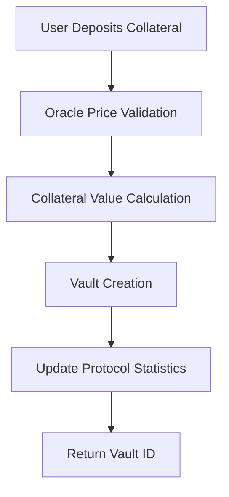
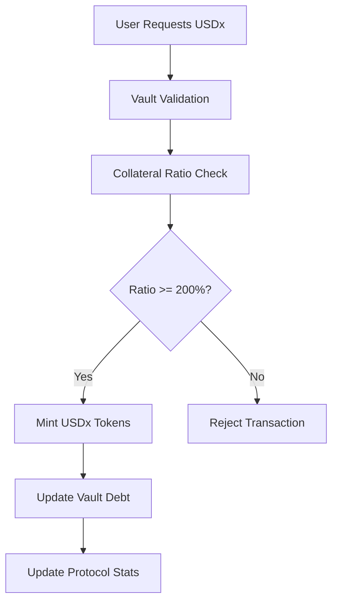
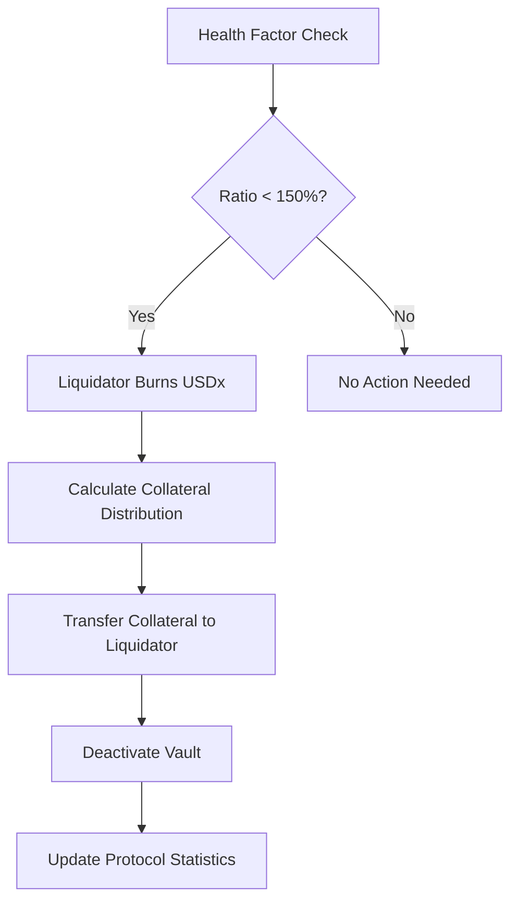

# VaultCoin Protocol

> Next-Generation Decentralized Stablecoin Infrastructure on Stacks

[](https://opensource.org/licenses/MIT)
[](https://stacks.co)
[](https://clarity-lang.org)

VaultCoin is a sophisticated multi-collateral stablecoin protocol engineered for the Stacks blockchain, delivering unprecedented stability and capital efficiency through advanced vault mechanics. The protocol revolutionizes DeFi lending by enabling users to unlock liquidity from their STX and xBTC holdings while maintaining exposure to potential upside.

## 🌟 Key Features

- **Multi-Asset Collateral Support**: Seamless support for STX and xBTC with expansion capabilities
- **Dynamic Risk Management**: Real-time oracle price feeds with confidence scoring
- **Automated Liquidation Engine**: Protection against market volatility with configurable parameters
- **SIP-010 Compliant USDx Token**: Full ecosystem compatibility with Stacks DeFi protocols
- **Governance-Ready Architecture**: Built for future decentralized operations
- **Capital Efficiency**: Minimized collateral requirements with 200% minimum ratio

## 🏗️ System Overview

VaultCoin operates as a decentralized lending protocol where users can:

1. **Deposit Collateral**: Lock STX and/or xBTC as collateral in individual vaults
2. **Mint Stablecoin**: Generate USDx tokens against collateral with minimum 200% ratio
3. **Manage Positions**: Add collateral, repay debt, or withdraw excess collateral
4. **Automated Safety**: Protocol monitors vault health and triggers liquidation when necessary

### Protocol Parameters

| Parameter | Value | Description |
|-----------|--------|-------------|
| Minimum Collateral Ratio | 200% | Required ratio for new vault creation |
| Liquidation Ratio | 150% | Threshold for vault liquidation |
| Liquidation Penalty | 10% | Additional penalty for liquidated vaults |
| Stability Fee | 2% | Annual fee on outstanding debt |
| Max Price Age | 1 hour | Maximum oracle price staleness |

## 🏛️ Contract Architecture

### Core Components

```text
VaultCoin Protocol
├── Token Layer (SIP-010)
│   ├── USDx Fungible Token
│   ├── Transfer Functions
│   └── Balance Management
├── Vault Management
│   ├── Vault Creation
│   ├── Collateral Management
│   ├── Debt Management
│   └── Position Tracking
├── Oracle System
│   ├── Price Feed Management
│   ├── Confidence Scoring
│   └── Staleness Protection
├── Liquidation Engine
│   ├── Health Factor Calculation
│   ├── Liquidation Execution
│   └── Collateral Distribution
└── Access Control
    ├── Owner Permissions
    ├── Oracle Operators
    └── Authorized Liquidators
```

### Data Structures

#### Vault Structure

```clarity
{
  owner: principal,           ; Vault owner
  stx-collateral: uint,      ; STX collateral amount
  xbtc-collateral: uint,     ; xBTC collateral amount
  debt: uint,                ; Outstanding USDx debt
  last-update: uint,         ; Last modification block
  is-active: bool            ; Vault status
}
```

#### Price Feed Structure

```clarity
{
  price: uint,               ; Asset price
  timestamp: uint,           ; Last update block
  confidence: uint           ; Confidence score (1-100)
}
```

## 🔄 Data Flow

### Vault Creation Flow



### USDx Minting Flow



### Liquidation Flow



## 🚀 Getting Started

### Prerequisites

- [Clarinet](https://github.com/hirosystems/clarinet) for testing and deployment
- [Node.js](https://nodejs.org/) v16+ for running tests
- [Stacks Wallet](https://wallet.hiro.so/) for interaction

### Installation

1. **Clone the repository**

   ```bash
   git clone https://github.com/opeyemi-precious/vault-coin.git
   cd vault-coin
   ```

2. **Install dependencies**

   ```bash
   npm install
   ```

3. **Run tests**

   ```bash
   clarinet test
   # or
   npm test
   ```

4. **Check contracts**

   ```bash
   clarinet check
   ```

### Deployment

1. **Configure deployment settings**

   ```bash
   # Edit settings/Devnet.toml, Testnet.toml, or Mainnet.toml
   ```

2. **Deploy to testnet**

   ```bash
   clarinet deploy --testnet
   ```

## 📋 Usage Examples

### Creating a Vault

```clarity
;; Create vault with 1000 STX collateral
(contract-call? .vault-coin create-vault u1000000000 u0)
```

### Minting USDx

```clarity
;; Mint 500 USDx from vault #1
(contract-call? .vault-coin mint-usdx u1 u500000000)
```

### Adding Collateral

```clarity
;; Add 500 STX to vault #1
(contract-call? .vault-coin add-collateral u1 u500000000 u0)
```

### Repaying Debt

```clarity
;; Burn 100 USDx to reduce debt
(contract-call? .vault-coin burn-usdx u1 u100000000)
```

## 🔧 API Reference

### Public Functions

| Function | Description | Parameters |
|----------|-------------|------------|
| `create-vault` | Create new collateral vault | `stx-amount`, `xbtc-amount` |
| `add-collateral` | Add collateral to vault | `vault-id`, `stx-amount`, `xbtc-amount` |
| `mint-usdx` | Mint USDx against collateral | `vault-id`, `amount` |
| `burn-usdx` | Burn USDx to reduce debt | `vault-id`, `amount` |
| `withdraw-collateral` | Withdraw excess collateral | `vault-id`, `stx-amount` |
| `liquidate-vault` | Liquidate unhealthy vault | `vault-id` |

### Read-Only Functions

| Function | Description | Returns |
|----------|-------------|---------|
| `get-vault` | Get vault information | Vault data or none |
| `get-user-vaults` | Get user's vault list | List of vault IDs |
| `get-protocol-stats` | Get protocol statistics | Protocol metrics |
| `calculate-health-factor` | Calculate vault health | Health factor percentage |
| `is-vault-safe` | Check liquidation safety | Boolean safety status |

## 🔒 Security Model

### Access Control

- **Contract Owner**: Oracle operator management, liquidator authorization, emergency functions
- **Oracle Operators**: Price feed updates with confidence scoring
- **Authorized Liquidators**: Vault liquidation execution

### Safety Mechanisms

- **Price Staleness Protection**: Prevents oracle manipulation attacks
- **Overflow Protection**: Input validation throughout the protocol
- **Minimum Ratios**: Enforced collateralization requirements
- **Emergency Shutdown**: Crisis management capabilities

### Audit Considerations

- Comprehensive input validation on all public functions
- Safe arithmetic operations preventing overflow/underflow
- Proper access control with role-based permissions
- Oracle dependency risks mitigated with staleness checks

## 🧪 Testing

The protocol includes comprehensive test coverage:

```bash
# Run all tests
npm test

# Run specific test file
npx vitest run tests/vault-coin.test.ts

# Run tests with coverage
npm run test:coverage
```

### Test Coverage Areas

- Vault creation and management
- USDx minting and burning
- Collateral operations
- Liquidation scenarios
- Oracle price updates
- Access control validation
- Edge cases and error handling

## 🤝 Contributing

We welcome contributions! Please see our [Contributing Guidelines](CONTRIBUTING.md) for details.

1. Fork the repository
2. Create a feature branch
3. Make your changes
4. Add tests for new functionality
5. Ensure all tests pass
6. Submit a pull request

## 📄 License

This project is licensed under the MIT License - see the [LICENSE](LICENSE) file for details.

## 🔗 Links

- [Stacks Documentation](https://docs.stacks.co/)
- [Clarity Language Reference](https://docs.stacks.co/clarity/)
- [SIP-010 Token Standard](https://github.com/stacksgov/sips/blob/main/sips/sip-010/sip-010-fungible-token-standard.md)
- [Clarinet Documentation](https://docs.hiro.so/clarinet/)

## ⚠️ Disclaimer

This software is experimental and provided "as is" without warranties. Use at your own risk. The protocol involves financial risk and should be thoroughly tested before mainnet deployment.

---

**Built with ❤️ on Stacks**
